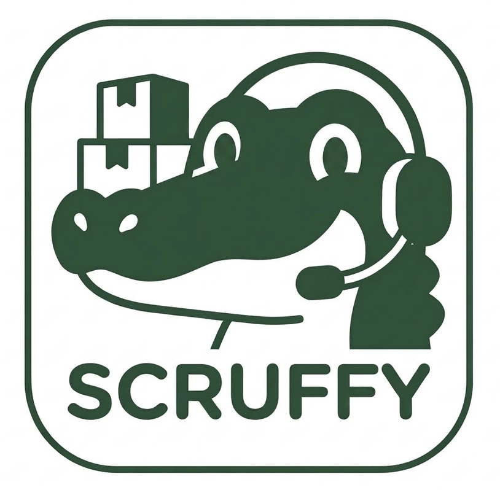

# Scruffy

**Replacing the "Human API" in B2B commerce.**

Scruffy is an agentic automation layer that logs into buyer portals, extracts raw purchase order (PO) data, normalizes messy text into canonical SKUs, and injects sanitized orders into supplier ERPs.



---

## Problem

B2B suppliers suffer from fragmented, messy order ingestion. Customers use bespoke portals and inconsistent terminology — ordering "Sweet-Disk" when the supplier SKU is `Choc-1`. Humans waste time translating and manually entering these orders.

## Solution

A three-stage pipeline:

| Stage | Tool | Output |
|-------|------|--------|
| **Extract** | Playwright (headless browser) | Raw PO text, line items, buyer metadata |
| **Normalize** | LLM + Pydantic schema | `CanonicalPO { sku, qty, uom, buyer_id }` |
| **Inject** | ERP API (SAP B1, NetSuite) | Order ID, API response |

## Core Mental Model

Agents are **non-deterministic routers inside a deterministic shell**:

```
┌─────────────────────────────────────────────────────────┐
│  DETERMINISTIC SHELL (while loop / LangGraph)           │
│                                                         │
│   observe → reason → act → observe → ... → terminal     │
│              ↑         │                                │
│              │         ▼                                │
│         [LLM router]  [MCP tools]                       │
│         non-det.      det. side effects                 │
└─────────────────────────────────────────────────────────┘
```

**Design rule:** The LLM chooses intent. Playwright executes precise actions. Pydantic validates results. A state machine decides whether to continue.

---

## Hardware

| Machine | Role |
|---------|------|
| **M4 Mac (16GB)** | Dev, orchestration, agent control loop |
| **Linux + RTX 5070 Ti** | Local LLM inference (Ollama / vLLM) over LAN |

Mac fires API requests to the Linux box for inference. Browser automation runs on the Mac.

---

## Tech Stack

| Concern | Choice |
|---------|--------|
| Browser automation | Playwright (Python) |
| Tool interface | Model Context Protocol (MCP) |
| Structured output | Pydantic + Instructor |
| Orchestration | LangGraph (explicit state machines) or raw ReAct loop |
| Lightweight agents | Smolagents (for learning spikes) |
| Testing | pytest + pytest-playwright |

### What we're NOT using (yet)

- Legacy RPA tools (UiPath, etc.)
- Overly abstracted agent frameworks
- Vector DBs for memory (file-based, inspectable state instead)
- Production ERP credentials in early phases

---

## Agent Building Approaches (Reference)

LangGraph is one option, not the only one. Most production agents share the same ReAct loop; the difference is how much infrastructure wraps it.

| Approach | When to use |
|----------|-------------|
| **Raw `while` loop** | Learning, full control, minimal deps (Claude Code uses this) |
| **LangGraph** | Named states, branching, HITL gates, auditability |
| **Smolagents** | Lightweight code-first agents |
| **MCP servers** | Standardized tool exposure (orthogonal to the loop) |
| **Temporal / durable workflows** | Long-running cloud agents (Cursor cloud agents use this) |

Claude Code and Cursor IDE agents are essentially **hand-rolled ReAct loops** with heavy investment in permissions, context management, tool concurrency, and subagent isolation — not LangGraph.

---

## Testing Strategy

Do not start by scraping real buyer portals. Use a layered approach:

```
        /\
       /  \   E2E on fake portal (few, slow)
      /----\
     /      \  DOM/fixture extraction tests (many, fast)
    /--------\
   /          \  Schema / normalization tests (many, very fast)
  /------------\
```

| Layer | Target | Purpose |
|-------|--------|---------|
| **1. Public practice sites** | saucedemo.com, practice.expandtesting.com | Learn Playwright mechanics |
| **2. Fake buyer portal** | `portals/` (local, we control it) | PO-specific extraction + agent eval |
| **3. Recorded fixtures** | Saved HTML, HAR, Playwright traces | Fast deterministic CI |
| **4. Real customer portals** | With explicit permission, sandbox creds | Validation only, shadow mode first |

### Evaluation fixtures (target set)

| Fixture | Challenge |
|---------|-----------|
| `login_basic` | Simple auth |
| `table_clean` | Straightforward extraction |
| `table_messy_headers` | Semantic column mapping |
| `pagination` | Multi-page collection |
| `csv_export` | Download parsing |
| `detail_page` | Click-through per PO |
| `hidden_export` | Menu navigation |
| `empty_orders` | Graceful no-op |
| `session_expired` | Recovery behavior |
| `broken_selector` | Retry / fail clearly |

---

## Phased Roadmap

### Phase 1 — Headless Browser Agents ✓

**Goal:** Deterministic Playwright harness. No LLM yet.

- [x] Project scaffold
- [x] Playwright on public practice site (login, table scrape, screenshot, trace)
- [x] Pydantic models for `RawPurchaseOrder`
- [x] Browser observation format (compact DOM → element map)
- [x] Fake buyer portal v1 (`portals/v1`)
- [x] Golden JSON tests against fixtures

### Phase 1.5 — Observation Layer ✓

**Goal:** Compress pages into typed snapshots for future agent loops.

- [x] `PageObservation` schema (`url`, `title`, `visible_text`, `interactive_elements`, `tables`)
- [x] `capture_page_observation()` via Playwright
- [x] `scripts/dump_observation.py` CLI
- [x] Tests against fake buyer portal pages

### Phase 1.75 — LLM connectivity (current)

**Goal:** Verify Mac → Linux Ollama path before Phase 2 agent loop.

- [x] `OllamaClient` + `BrowserAction` schema
- [x] `scripts/test_ollama.py` smoke + structured JSON test
- [ ] Phase 2 constrained action loop wired to Playwright

### Phase 2 — Constrained Browser Agent

**Goal:** LLM chooses from a typed action menu. Playwright executes.

- [ ] Action schema: `click`, `type`, `extract_table`, `download`, `finish`, `fail`
- [x] Observation layer: URL + visible text + interactive element map
- [ ] ReAct loop (raw `while` or Smolagents)
- [ ] Eval runner scoring extraction accuracy

### Phase 3 — Semantic Normalization

**Goal:** Map messy buyer text to canonical SKUs.

- [ ] `CanonicalPurchaseOrder` Pydantic schema
- [ ] Instructor + local LLM on Linux box
- [ ] SKU catalog fixture
- [ ] Confidence scores + evidence fields

### Phase 4 — MCP Tool Servers

**Goal:** Expose browser + normalization as MCP tools.

- [ ] `scruffy-browser` MCP server (Playwright operations)
- [ ] `scruffy-normalize` MCP server (PO → canonical)
- [ ] Tool-callable from any agent loop

### Phase 5 — Pipeline Orchestration

**Goal:** Explicit state machine for the full ingest flow.

- [ ] LangGraph: `portal_login → po_extracted → normalized → injected → done`
- [ ] Human-in-the-loop gates for low-confidence mappings
- [ ] Audit trail per PO

### Phase 6 — ERP Injection

**Goal:** Push canonical POs into supplier systems.

- [ ] Mock ERP API
- [ ] SAP B1 / NetSuite adapter (sandbox)
- [ ] Idempotent order creation

### Phase 7 — Customer Shadow Mode

**Goal:** Run against real portals with permission.

- [ ] Read-only extraction on customer sandbox
- [ ] Compare Scruffy output vs human-entered orders
- [ ] Supervised write actions

---

## Project Structure

```
scruffy/
├── assets/              # Logo, screenshots
├── docs/                # Research notes (portal-research.md)
├── portals/v1/          # Fake Coupa-style buyer portal
├── scripts/             # Runnable demos
├── src/scruffy/
│   ├── browser/         # Playwright runner, extractors, scraper
│   └── models/          # Pydantic schemas (RawPO, CanonicalPO)
└── tests/               # pytest + playwright tests
```

---

## Quick Start

```bash
# Install dependencies
pip install -e ".[dev,portal]"

# Install Playwright browsers
playwright install chromium

# Start fake buyer portal (terminal 1)
python portals/v1/server.py

# Scrape a PO (terminal 2)
python scripts/scrape_buyer_portal.py --headed

# Dump page observation JSON (portal must be running)
python scripts/dump_observation.py --page orders
python scripts/dump_observation.py --page po --po PO-1042 --headed

# Test Linux Ollama box (Qwen)
python scripts/test_ollama.py
# or: SCRUFFY_OLLAMA_URL=http://192.168.0.7:11434 python scripts/test_ollama.py

# Run practice site scraper
python scripts/scrape_practice_site.py

# Run tests
pytest -m browser
```

---

## Phase 1.5 — Current Focus

Compress each portal page into a typed `PageObservation` that a future agent loop can reason over:

```json
{
  "url": "http://127.0.0.1:8000/orders",
  "title": "Purchase Orders — Midwest Foods Vendor Portal",
  "visible_text": "...",
  "interactive_elements": [
    { "id": "e1", "role": "link", "text": "PO-1042", "test_id": "po-link-PO-1042" }
  ],
  "tables": [
    { "id": "orders-table", "headers": ["PO Number", "Order Date", ...], "row_count": 3 }
  ]
}
```

No LLM yet — just the eyes. Phase 2 adds the brain.

---

## Customer Discovery (Parallel Track)

While building, continue validating with suppliers:

- How many buyer portals do they log into daily?
- What % of orders arrive via portal vs email vs EDI?
- Where do SKU mismatches cause the most pain?
- What does a failed order ingestion cost them?

The prototype exists to **learn agentic concepts** and **demo the extraction problem** — not as a finalized product roadmap.
